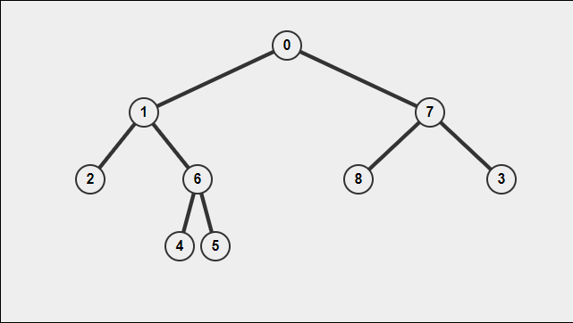

Traversing binary trees is a fundamental skill required for coding interviews. Today I will teach you the main ways of traversing a binary tree. Each traversal style is associated with a specific pattern. Below is a quick reference. (All code examples are worked in python)

### Binary Tree Traversal Cheat Sheet

| Traversal   | ->   | Pattern           |
| ----------- | ---- | ----------------- |
| In-order    |      | left/center/right |
| pre-order   |      | center/left/right |
| post-order  |      | left/right/center |
| level-order |      | self explanatory  |

### Example



#### Pre-Order Traversal

A preorder traversal follows the center-left-right pattern. For the tree above, the output would be [0,1,2,6,4,5,7,8,3]

##### Solution

```python
def preOrderHelper(tree):
    array = []
	if tree != None:
		array.append(tree.value)
		preOrderHelper(tree.left,array)
		preOrderHelper(tree.right,array)
    return array
```

#### In-Order Traversal

An inorder traversal follows the left-center-right pattern. The algorithm will traverse as far left as possible and then add each center node with the right node being added last. An in-order traversal of the graph above would output [2,1,4,6,5,0,7,8,3]

##### Solution

```python
def inOrder(tree):
    array = []
	if tree != None:
		inOrderHelper(tree.left,array)
		array.append(tree.value)
		inOrderHelper(tree.right,array)
	return array
```

#### Post-Order Traversal

A postorder traversal follows the left-right-center pattern. For the tree above the output would be [2,4,5,6,1,8,3,7,0].

##### Solution

```python
def postOrder(tree):
    out = []
	if tree != None:
		postOrderHelper(tree.left,array)
		postOrderHelper(tree.right,array)
		array.append(tree.value)
```

#### Level Order Traversal

A level order traversal will return a two dimensional list of every level in the tree. For the example above, the result would be:

[[0], [1,7], [2,6,8,3], [4,5]]

The code below uses a helper function. The helper function keeps track of which level of the tree it is located in. 

##### Solution

```python
def levelOrder(root: TreeNode) -> List[List[int]]:
        if root == None:
            return [[]]
        acc = [[]]
        helper(root,acc,0)
        return acc
    
def helper(root,acc,ind):
    if root == None:
        return acc
    else:
        if len(acc) < ind + 1:
            acc.append([])
        acc[ind].append(root.val)
        helper(root.left,acc,ind + 1)
        helper(root.right,acc,ind + 1)
        return acc
```


